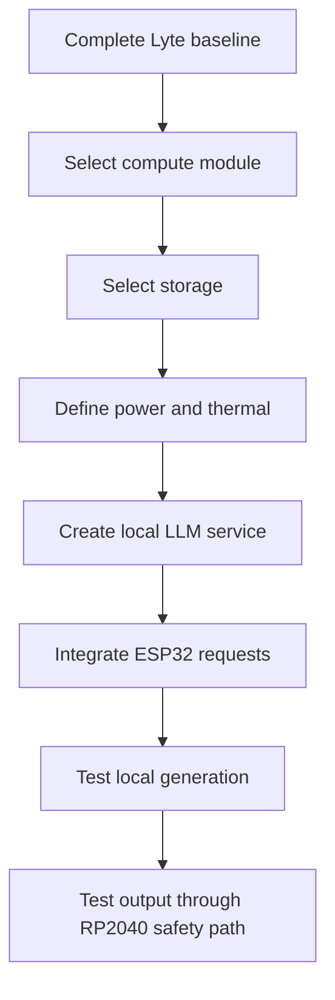

# Development Flowchart — Advanced

```mermaid
flowchart TD
    A[Complete Lyte baseline] --> B[Select compute module]
    B --> C[Select storage]
    C --> D[Define power and thermal]
    D --> E[Create local LLM service]
    E --> F[Integrate ESP32 requests]
    F --> G[Test local generation]
    G --> H[Test output through RP2040 safety path]
```
