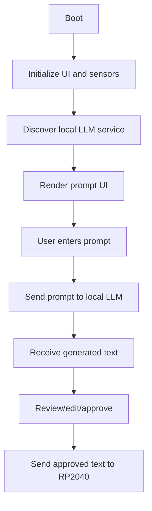

# ESP32 Software Flowchart — Advanced

```mermaid
flowchart TD
    A[Boot] --> B[Initialize UI and sensors]
    B --> C[Discover local LLM service]
    C --> D[Render prompt UI]
    D --> E[User enters prompt]
    E --> F[Send prompt to local LLM]
    F --> G[Receive generated text]
    G --> H[Review/edit/approve]
    H --> I[Send approved text to RP2040]
```
