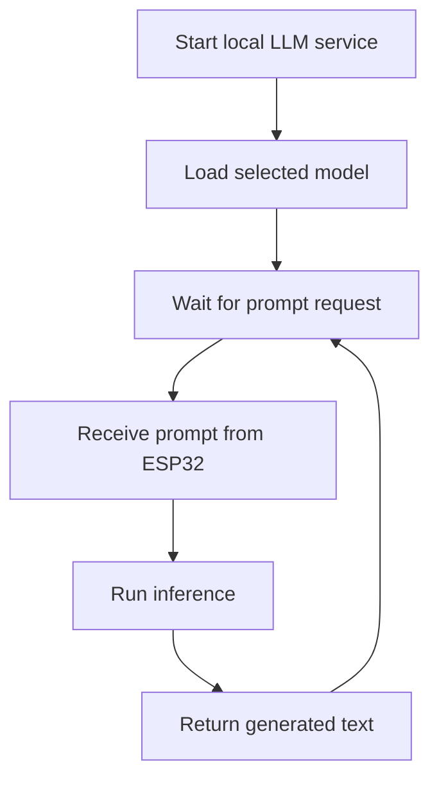

# Local LLM Subsystem Flowchart

```mermaid
flowchart TD
    A[Start local LLM service] --> B[Load selected model]
    B --> C[Wait for prompt request]
    C --> D[Receive prompt from ESP32]
    D --> E[Run inference]
    E --> F[Return generated text]
    F --> C
```
