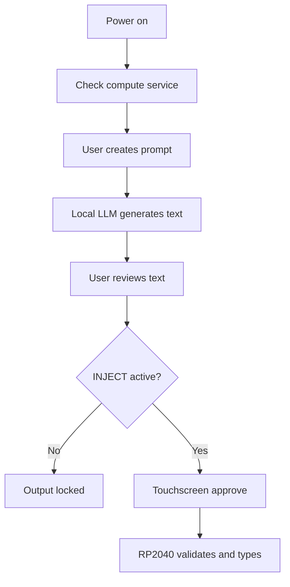

# Overall System Flowchart — Advanced

```mermaid
flowchart TD
    A[Power on] --> B[Check compute service]
    B --> C[User creates prompt]
    C --> D[Local LLM generates text]
    D --> E[User reviews text]
    E --> F{INJECT active?}
    F -->|No| G[Output locked]
    F -->|Yes| H[Touchscreen approve]
    H --> I[RP2040 validates and types]
```
