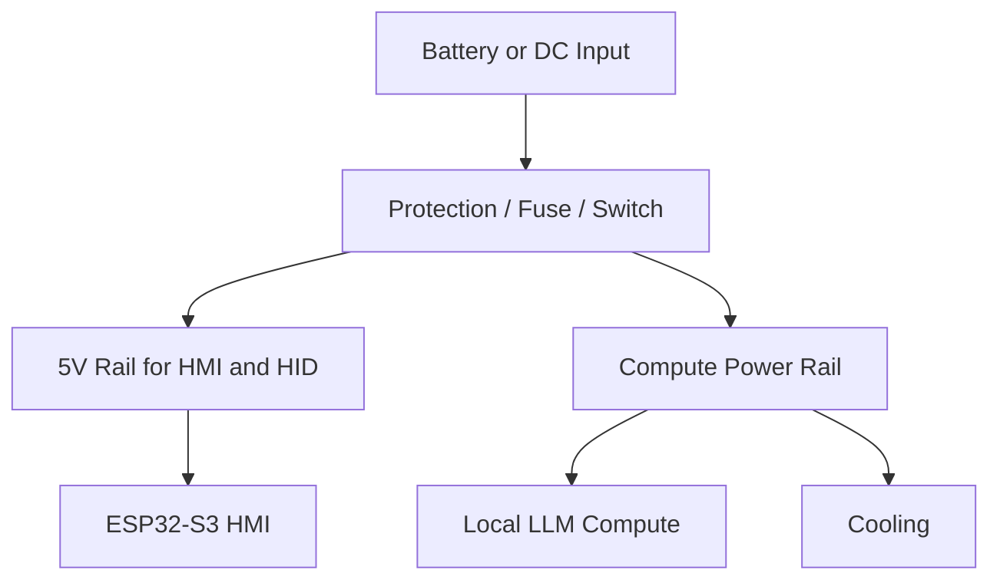

# Power Source Diagram — Advanced

```mermaid
flowchart TD
    Input[Battery or DC Input] --> Protection[Protection / Fuse / Switch]
    Protection --> Rail5[5V Rail for HMI and HID]
    Protection --> ComputeRail[Compute Power Rail]
    Rail5 --> ESP[ESP32-S3 HMI]
    ComputeRail --> LLM[Local LLM Compute]
    ComputeRail --> Fan[Cooling]
```
