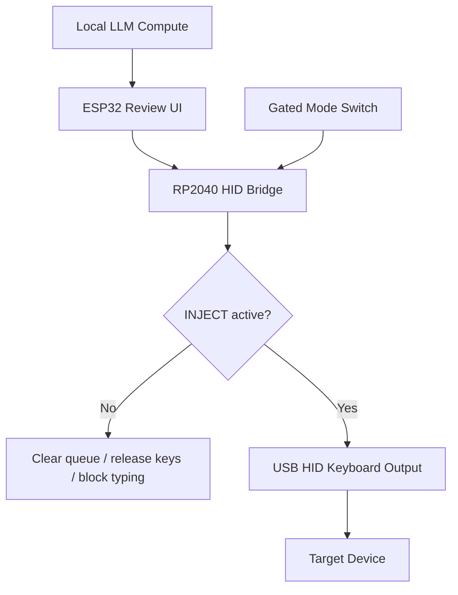

# Safety Circuit Diagram — Advanced

```mermaid
flowchart TD
    LLM[Local LLM Compute] --> ESP[ESP32 Review UI]
    ESP --> RP[RP2040 HID Bridge]
    Switch[Gated Mode Switch] --> RP
    RP --> Safe{INJECT active?}
    Safe -->|No| Block[Clear queue / release keys / block typing]
    Safe -->|Yes| Type[USB HID Keyboard Output]
    Type --> Target[Target Device]
```

Local compute never has direct target-output authority.
