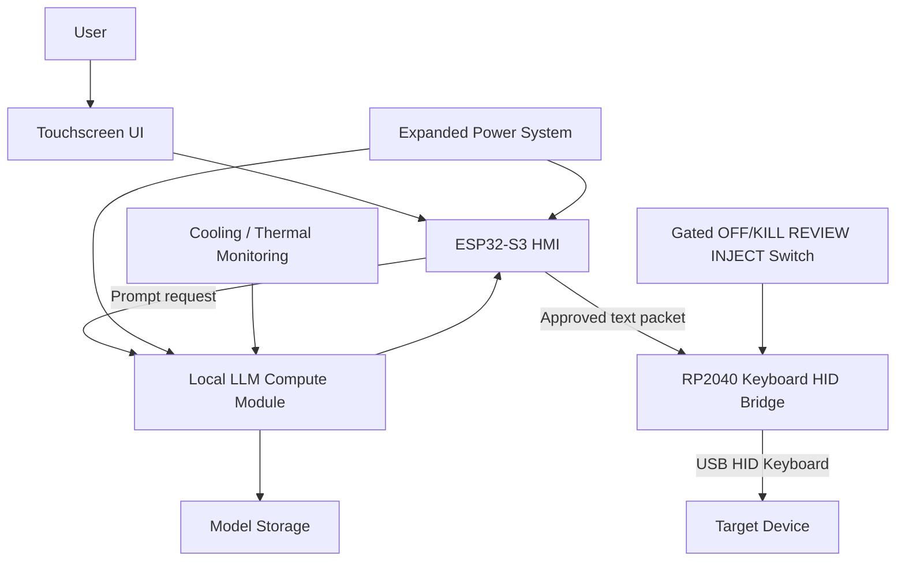

# System Diagram — KeyPrompt Advanced

```mermaid
flowchart TD
    User[User] --> Touch[Touchscreen UI]
    Touch --> ESP[ESP32-S3 HMI]
    ESP -->|Prompt request| LLM[Local LLM Compute Module]
    LLM --> Storage[Model Storage]
    LLM --> ESP
    ESP -->|Approved text packet| RP[RP2040 Keyboard HID Bridge]
    Switch[Gated OFF/KILL REVIEW INJECT Switch] --> RP
    RP -->|USB HID Keyboard| Target[Target Device]
    Power[Expanded Power System] --> ESP
    Power --> LLM
    Cooling[Cooling / Thermal Monitoring] --> LLM
```
