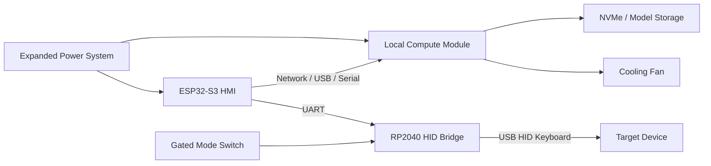

# Wiring Diagram — KeyPrompt Advanced

```mermaid
flowchart LR
    Power[Expanded Power System] --> ESP[ESP32-S3 HMI]
    Power --> Compute[Local Compute Module]
    ESP -->|Network / USB / Serial| Compute
    ESP -->|UART| RP[RP2040 HID Bridge]
    Switch[Gated Mode Switch] --> RP
    RP -->|USB HID Keyboard| Target[Target Device]
    Compute --> Storage[NVMe / Model Storage]
    Compute --> Fan[Cooling Fan]
```
