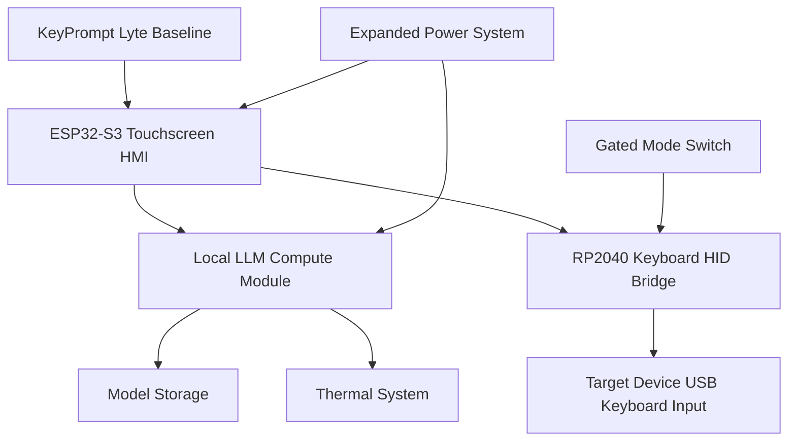

# Hardware Overview — KeyPrompt Advanced

```mermaid
flowchart TD
    Lyte[KeyPrompt Lyte Baseline] --> ESP[ESP32-S3 Touchscreen HMI]
    ESP --> Compute[Local LLM Compute Module]
    Compute --> Storage[Model Storage]
    Compute --> Cooling[Thermal System]
    ESP --> RP[RP2040 Keyboard HID Bridge]
    RP --> Target[Target Device USB Keyboard Input]
    Power[Expanded Power System] --> ESP
    Power --> Compute
    Switch[Gated Mode Switch] --> RP
```
